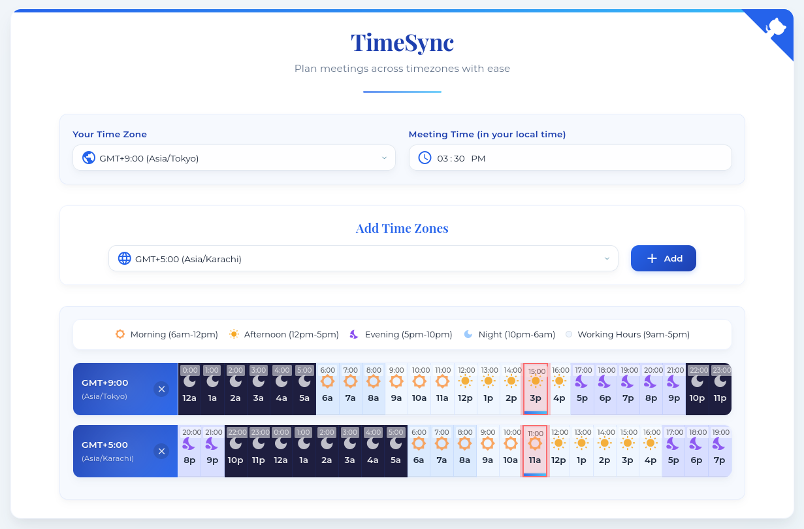

# TimeSync

<div align="center">
  <p><em>A sleek, browser-based tool for planning meetings across multiple time zones.</em></p>
  
</div>

## Features

- **Simple Time Zone Management**: Easily add and remove time zones to compare
- **Visual Time Period Indicators**: Color-coded time blocks with icons for morning, afternoon, evening, and night
- **Working Hours Highlight**: Quickly identify standard business hours (9 AM - 5 PM)
- **Mobile-Optimized Interface**: Fully responsive design with touch-friendly controls for all devices
- **Time Alignment**: Horizontally aligned time display makes it easy to find meeting times that work for everyone
- **Selected Time Highlighting**: Clear red highlighting of the chosen meeting time across all time zones

## Usage

1. Select your time zone from the dropdown
2. Set your meeting time (in your local time)
3. Add time zones for your meeting participants
4. Find the optimal meeting time by viewing the aligned time blocks

## Live Demo

Try it now: [TimeSync Demo](https://trytimesync.vercel.app/)

## Installation

No installation required! This is a client-side application that runs entirely in the browser.

To run locally:

```bash
# Clone the repository
git clone https://github.com/mo-haggag/timesync.git

# Navigate to the project directory
cd timesync

# Open in a browser
open index.html
```

## Development

TimeSync is built with vanilla JavaScript, HTML, and CSS - no frameworks or build steps required.

The codebase consists of three main files:
- `index.html` - Page structure
- `styles.css` - Visual styling
- `app.js` - Application logic and interactivity

## Acknowledgments

- Inspired by the need to coordinate meetings across distributed teams
- Icons from [Google Material Icons](https://fonts.google.com/icons)
- Fonts from [Google Fonts](https://fonts.google.com/)
